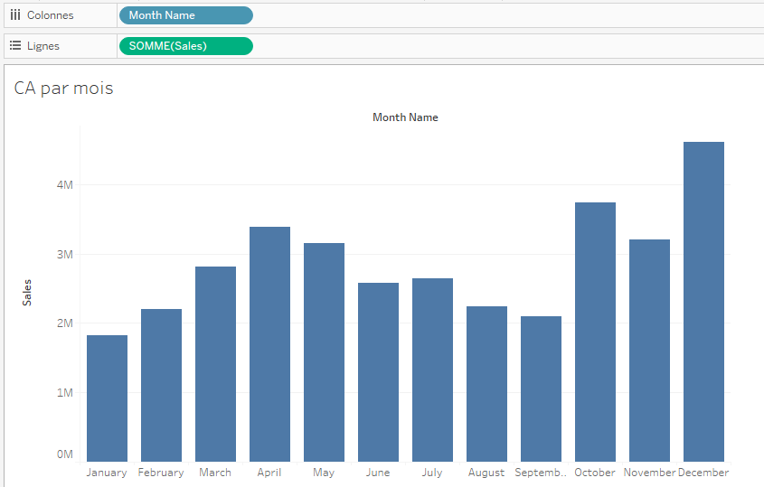
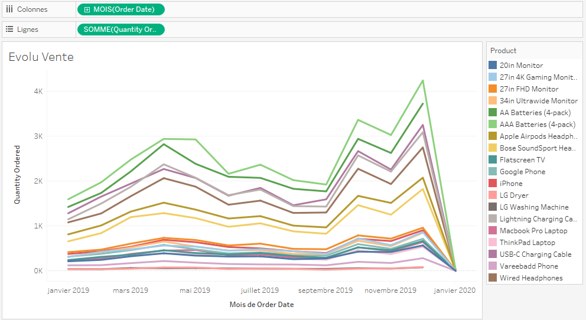
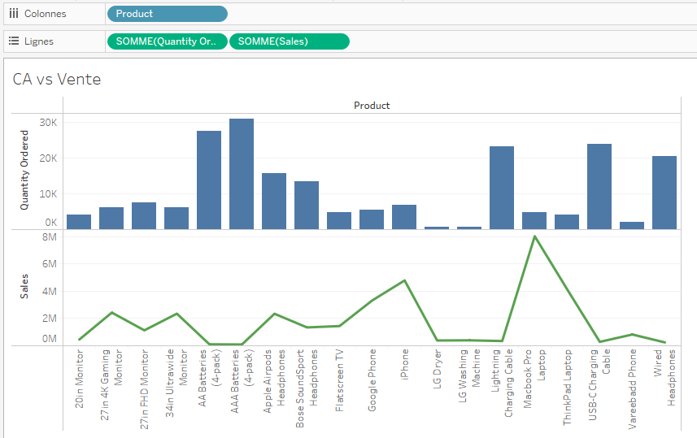
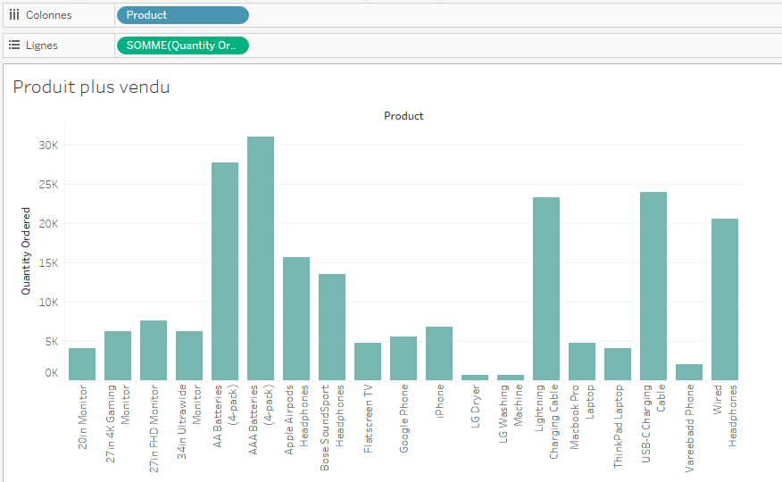
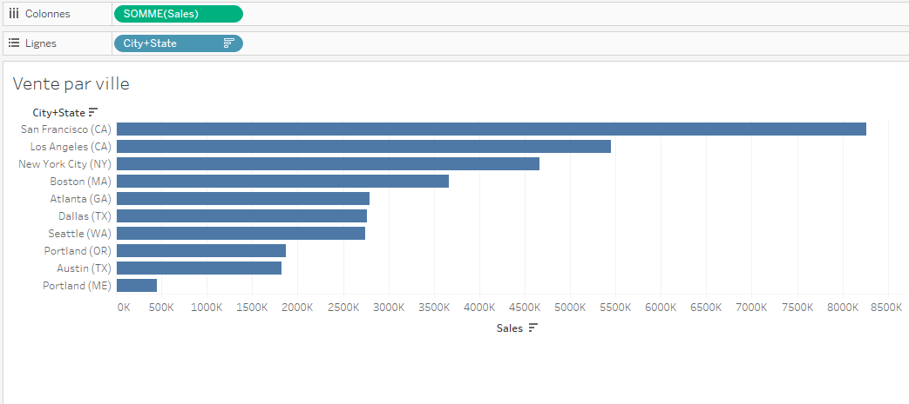

# Sales-Data-Visualization
## Dataset description
The dataset analyzed in this project contains the **sales data of electronic devices** from a company for the entire year of **2019**. This data is compiled from 12 separate datasets, each corresponding to one month of the year (from January to December 2019), and downloaded from the Kaggle platform.

Each dataset includes between **12,000** and **25,000** transactions (rows) and follows the same structure, with six columns providing the following information:  
**-Order ID**  
**-Product**  
**-Quantity Ordered**  
**-Price Each**  
**-Order Date**  
**-Purchase Address**

[Original datasets](https://github.com/202422/Sales-Data-Visualization/tree/main/Raw%20Data)

## Visualization objectives

The analysis of this dataset aims to answer specific questions to better understand the sales dynamics of electronic devices in 2019. The main objectives are as follows:  
**-Identify the best-performing months**  
**-Analyze profitability by day of the week**  
**-Evaluate geographic performance**  
**-Study product trends**  
**-Determine top-selling products**  
**-Correlate price with sales volume**  

## Data preparation for Visualization

To prepare the data for optimal visualization in Tableau, a thorough preprocessing workflow was applied to the 12 monthly CSV files using Python and the pandas library. The following steps were carried out:

-**File merging**: The 12 CSV files, each representing one month of sales, were listed and combined into a single DataFrame.  
-**Data cleaning**: Rows with missing values and redundancies were removed, as well as the ID column.  
-**Data type conversion**: The *Order Date* column was converted to datetime format, and *Quantity Ordered* and *Price Each* were converted to numeric types.  
-**Data enrichment**: New columns were created, including *Sales*, *Month*, *Month Name*, *Year*, *Hour*, *City*, *State*, and *City+State*.

The final dataset contains over 180,000 rows and 15 columns.

[Cleaning Notebook and final dataset](https://github.com/202422/Sales-Data-Visualization/tree/main/Transformed%20Data)

## Some Charts

   
   
   
      

[Tableau WorkBook](https://github.com/202422/Sales-Data-Visualization/tree/main/Tableau%20WorkBook)
